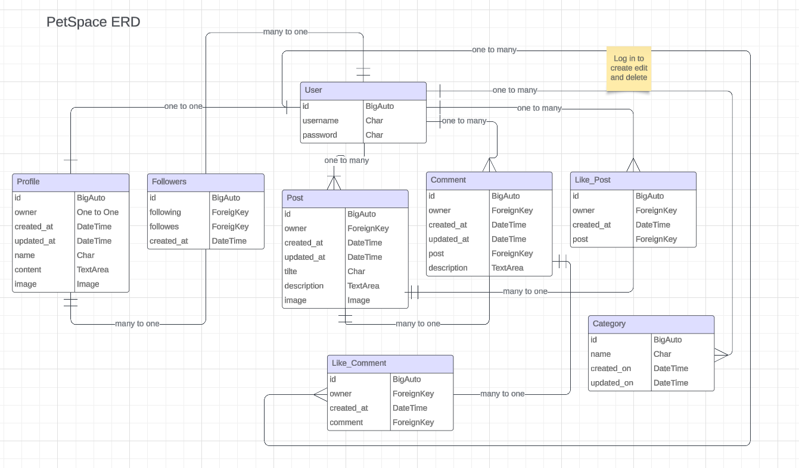

 

<h2>PetSpace backend API</h2>

<h1 id="contents">Contents</h1>

-   [Introduction](#introduction)
-   [Database Schema](#database-schema)
-   [User Stories](#user-stories)
-   [Agile Methodology](#agile-methodology)
-   [Technologies Used](#technologies-used)
    -   [Languages](#languages)
    -   [Frameworks, libraries, and Programs](#frameworks-libraries-and-programs)
-   [Testing Automated and Manual](TESTING.md)
-   [Bugs](#bugs)
-   [Project Setup](#project-setup)
-   [Deployment](#deployment)
    -   [Setting up JSON web tokens](#setting-up-json-web-tokens)
    -   [Prepare API for deployment to Heroku](#prepare-api-for-deployment-to-heroku)
    -   [Deployment to Heroku](#deployment-to-heroku)
    -   [Database Creation Elephant SQL](#elephantsql)
-   [Credits](#credits)
-   [Acknowledgements](#acknowledgements)

## Introduction

This repository is the backend API utilising the Django REST Framework(DRF).

The React frontend repository can be found <a href="https://github.com/alsona1188/petspace_frontend-pp5" target="_blank">HERE </a>  
 

## Database Schema

<h2 id="user-stories">User Stories</h2>

## User stories

| Category  | as      | I want to                      | so that I can                                                                                    | mapping API feature                          |
| --------- | ------- | ------------------------------ | ------------------------------------------------------------------------------------------------ | -------------------------------------------- |
| auth      | user    | register for an account        | have a personal profile with a picture                                                           | dj-rest-auth Create profile (signals)     |
| auth      | user    | register for an account        | create, like and comment on posts                                                                | Create post Create comment Create like |
| auth      | user    | register for an account        | follow users                                                                                     | Create follower                              |
| posts     | visitor | view a list of posts           | browse the most recent uploads                                                                   | List/ Filter posts                           |
| posts     | visitor | view an individual post        | see user feedback, i.e. likes and read comments                                                  | Retrieve post                                |
| posts     | visitor | search a list of posts         | find a post by a specific artist or a title                                                      | List/ Filter posts                           |
| posts     | visitor | scroll through a list of posts | browse the site more comfortably                                                                 | List/ Filter posts                           |
| posts     | user    | edit and delete my post        | correct or hide any mistakes                                                                     | Update property Destroy property          |
| posts     | user    | create a post                  | share my moments with others                                                                     | Create post                                  |
| posts     | user    | view liked posts               | go back often to my favourite posts                                                              | List/ Filter posts                           |
| posts     | user    | view followed users' posts     | keep up with my favourite users' moments                                                         | List/ Filter posts                           |
| like      | user    | like a post/ comment           | express my interest in someone's shared moment                                                   | Create like                                  |
| like      | user    | unlike a post/ comment         | express that my interest in someone's shared moment has faded away                               | Destroy like                                 |
| comments  | user    | create a comment               | share my thoughts on other people's content                                                      | Create comment                               |
| comments  | user    | edit and delete my comment     | correct or hide any mistakes                                                                     | Update comment Destroy comment            |
| profiles  | user    | view a profile                 | see a user's recent posts + post, followers, following count data                                | Retrieve profile List/ filter posts       |
| profiles  | user    | edit a profile                 | update my profile information                                                                    | Update profile                               |
| followers | user    | follow a profile               | express my interest in someone's content                                                         | Create follower                              |
| followers | user    | unfollow a profile             | express that my interest in someone's content has faded away and remove their posts from my feed | Destroy follower                             |
| category  | user    | create a category              | add that category to the database so other users can use it too                                  | Create a category                            |

<h2 id="agile-methodology">Agile Methodology</h2>

<a href="#top">Back to the top.</a>

The Agile Methodology was used to plan this project. This was implemented through Github and the Project Board which can be seen here

Through the use of the Kanban board in the projects view in Github, the project was divived into a few different sections:

-   Todo
-   In Progress
-   Done

Github issues were used to create User Stories and any other fixes or updates for the project. This was where the project user was assigned, labels were added to provide clarity, and the story was added to the appropriate sprint and the project. Each User Story, Fix or Update had a clear title.

Milestones were used to create sprints. There were 2 sprints each dated appropriately. User Stories were completed based on the current sprint in progress. Each sprint was completed on time.

1 enhancement features was not completed and was left for further development.

The Github issues were not just used to record User Stories but also used to record any bug fixes or updates to the codebase as well.

